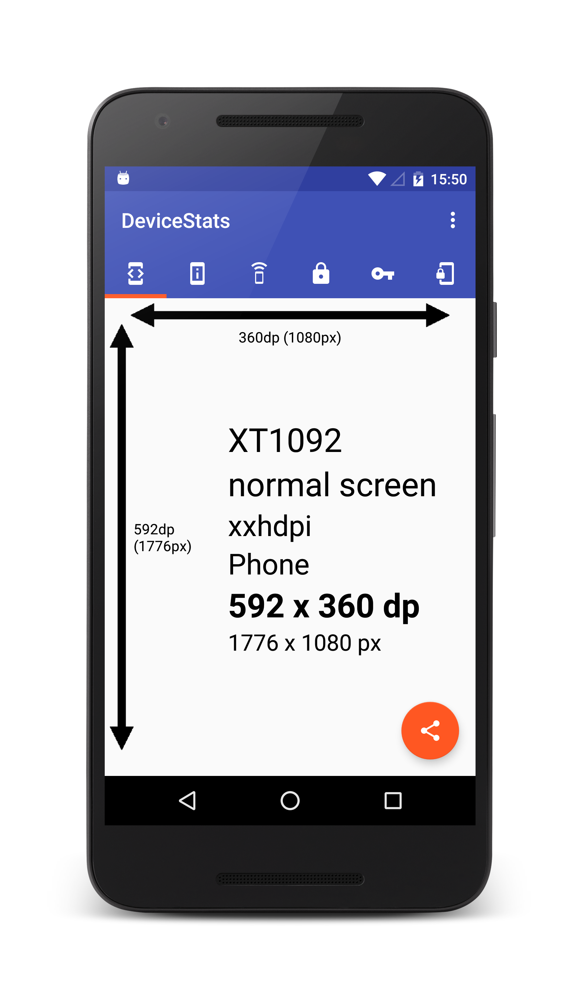

#Device stats app
 
For app developers and testers to quickly and easily display and share device information and statistics. Simple enough for the client to use ;)  

Created initially as I was looking into some security hardening techniques and found some older Android devices and more recent Chinese devices didn't support the crypto algorithms and SSL Cipher suites I was expecting. 

Available on [Google play](https://play.google.com/store/apps/details?id=com.devicestats.android) 

##Credits 

* [Andy.B](https://github.com/andyb129) for a UI overhaul from 1.0 to 1.1 
* Some if the device dimensions resource files and code are from https://bitbucket.org/hvisser/sizemeup - thanks to Hugo for that! 

##Licence 

	Copyright (c) 2015 Scott Alexander-Bown
    
    Licensed under the Apache License, Version 2.0 (the "License");
    you may not use this file except in compliance with the License.
    You may obtain a copy of the License at
    
    http://www.apache.org/licenses/LICENSE-2.0

    Unless required by applicable law or agreed to in writing, software
    distributed under the License is distributed on an "AS IS" BASIS,
    WITHOUT WARRANTIES OR CONDITIONS OF ANY KIND, either express or implied.
    See the License for the specific language governing permissions and
    limitations under the License.